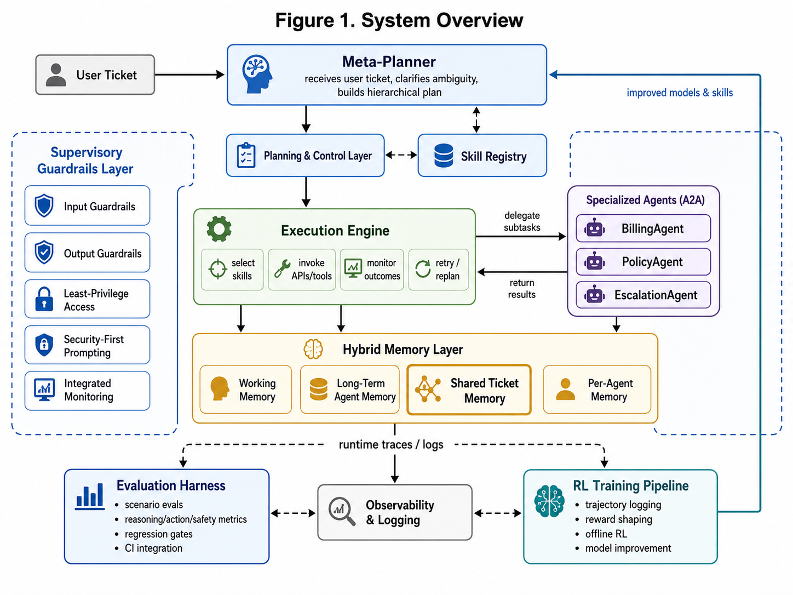

# Zendesk Agentic System — Proof of Concept

A working end-to-end demonstration of Zendesk's next-generation agentic customer service architecture, covering all capability areas from the 8-month backlog. Uses only open-source components and runs entirely locally.

---

## Architecture at a glance

```
                        ┌─────────────────────────────────────────────────────┐
                        │   LLMClient — runtime-switchable provider            │
                        │   Ollama Mistral 7B  ⇄  Anthropic Claude             │
                        │   switch via UI sidebar or PUT /config/llm-provider  │
                        └──────────────────┬──────────────────────────────────┘
                                           │
                        ┌──────────────────▼──────────────────────────────────┐
                        │              MetaPlannerAgent  (LangGraph)           │
                        │  decompose → clarify / delegate / self-handle        │
                        └──────────────────┬──────────────────────────────────┘
                  A2A DelegationContract   │    CapabilityRegistry
             ┌────────────────────────────┼────────────────────────────┐
             ▼                            ▼                            ▼
      BillingAgent                 PolicyAgent                EscalationAgent
    (process_refund)             (check_policy)             (escalate_ticket)
             │                            │                            │
             └────────────────────────────┼────────────────────────────┘
                                          │
                          ┌───────────────▼───────────────┐
                          │     Hybrid Memory Layer        │
                          │  WorkingMemory (in-process)    │
                          │  SharedTicketMemory (Redis)    │
                          │  PerAgentMemory (SQLite)       │
                          │  VectorMemory (ChromaDB)       │
                          └───────────────────────────────┘
                                          │
              ┌───────────────────────────┼───────────────────────────┐
              ▼                           ▼                            ▼
       InputGuardrails            EvaluationHarness            TrajectoryLogger
    (PII / injection)           (layered metrics + CI)        (offline RL data)
              │                           │                            │
              ▼                           ▼                            ▼
       OutputGuardrails         RegressionGate (.github/CI)    offline_rl.py
     (scrub / hallucinate)                                    (ORPO fine-tuning)
```

Every A2A delegation, delegated-task handoff, skill execution, and `/ticket` API
request emits an OpenTelemetry span, so a single request can be followed
end-to-end in Jaeger — see [Observability](#observability).

### Open-source stack

| Layer | Technology | Licence |
|---|---|---|
| LLM reasoning | Ollama · Mistral 7B-Instruct (default) — swappable to Anthropic Claude | MIT / commercial |
| Agent framework | LangGraph | MIT |
| Shared memory | Redis 7 (optimistic locking) | BSD |
| Vector / episodic memory | ChromaDB (embedded) | Apache 2.0 |
| Structured memory | SQLite + SQLModel | MIT |
| Guardrails | Regex + Presidio-style patterns | MIT |
| RL training | Hugging Face TRL · ORPO | Apache 2.0 |
| Tracing | OpenTelemetry → Jaeger | Apache 2.0 |
| Metrics | Prometheus + Grafana | Apache 2.0 |
| Synthetic data | Faker | MIT |
| REST API | FastAPI + Uvicorn | MIT |
| **UI** | **Streamlit + Plotly** | **Apache 2.0** |
| Testing | pytest + pytest-cov | MIT |

---

## LLM Provider (Ollama ⇄ Anthropic Claude)

The MetaPlanner's LLM backend is pluggable (`agents/llm_client.py`). Both providers
implement the same `LLMClient.complete(prompt) -> LLMResponse` interface, so the
planner graph is agnostic to which one is active.

| Provider | `LLM_PROVIDER` value | Requires | Notes |
|---|---|---|---|
| Ollama (default) | `ollama` | Local `mistral:7b-instruct` via Docker | Free, runs entirely offline |
| Anthropic Claude | `anthropic` | `ANTHROPIC_API_KEY` in `.env` | Billed to your Anthropic account; model set via `ANTHROPIC_MODEL` (default `claude-haiku-4-5-20251001`) |

The provider can be changed **at runtime, without restarting the app**:
- **UI** — the "LLM Provider" selector in the Streamlit sidebar calls `MetaPlannerAgent.switch_provider()` and reruns the page.
- **API** — `GET /config/llm-provider` / `PUT /config/llm-provider` (see [REST API](#rest-api)).

Set the default provider on startup via `.env`:

```bash
LLM_PROVIDER=ollama          # or "anthropic"
ANTHROPIC_API_KEY=           # required if LLM_PROVIDER=anthropic or switching to it at runtime
ANTHROPIC_MODEL=claude-haiku-4-5-20251001
```

---

## Prerequisites

| Tool | Version | Notes |
|---|---|---|
| Python | ≥ 3.11 | |
| Docker Desktop | ≥ 24 | For all infrastructure services |
| ~15 GB disk | — | Mistral 7B (~4 GB) + Qwen 0.5B (~1 GB) + deps |
| ~8 GB RAM | — | Minimum for Mistral inference |

---

## To Run It

### Step 1 — Clone and install dependencies

```bash
git clone <repo-url>
cd zendesk_agent_project

```

### Step 2 — Start all infrastructure services

```bash
docker-compose up -d
```

This starts:

| Service | URL | Notes |
|---|---|---|
| **Redis** | `localhost:6379` | Shared ticket memory |
| **Ollama** | `http://localhost:11434` | Pulls `mistral:7b-instruct` on first start (~5 min) |
| **Jaeger** | `http://localhost:16686` | Distributed trace UI |
| **Prometheus** | `http://localhost:9090` | Metrics scraper |
| **Grafana** | `http://localhost:3000` | Dashboards — login `admin / admin` |

> **First-run note:** Ollama pulls the Mistral 7B model on startup. Wait until `docker-compose logs ollama` shows `model loaded` before proceeding.

### Step 3 — Generate synthetic data

```bash
python synthetic_data/ticket_generator.py
```

Creates:
- `data/tickets.json` — 1,000 support tickets (5 categories)
- `data/customers.json` — 200 customers (standard / premium / VIP tiers)
- `data/orders.json` — ~600 orders linked to customers

### Step 4 — Launch the UI

```bash
streamlit run ui/app.py
```

Opens at **`http://localhost:8501`** — see [UI section](#ui-application) below.

### Step 5 (optional) — Run the automated demo

```bash
python demo/run_demo.py
```

Runs all 8 capability scenarios end-to-end and prints a structured report.

### Step 6 (optional) — Start the REST API

```bash
uvicorn api.main:app --reload --port 8000
```

API docs available at `http://localhost:8000/docs`.

---

## UI Application

The Streamlit UI (`streamlit run ui/app.py`) is the primary interface for exploring the agent system. It has six pages, accessible from the left sidebar.

The sidebar also shows live infrastructure status (Redis, a real Ollama `/api/tags`
liveness check) and the active LLM provider, plus an **LLM Provider** selector to
switch between Ollama and Anthropic Claude at runtime — see the "LLM Provider" section above.

### 🎫 Submit Ticket

The main interaction page. Fill in a ticket subject, body, category, priority, and optional order ID / amount, then click **Submit Ticket**.

- **Quick examples** in one click: billing refund, policy question, VIP escalation, prompt injection attempt
- Displays the **execution trace** — each plan step, the skill invoked, inputs, outputs, and latency
- Shows **outcome** (resolved / escalated / failed / blocked) with reward score
- Blocked requests (prompt injection) never reach the agent



### 🔍 Ticket Inspector

Enter any ticket ID (recent tickets appear in a dropdown) to inspect its **shared Redis memory state**: version number, ticket fields, active plan, agent notes, and tool results.

### 🛠️ Agent Dashboard

- **Skill Registry table** — all registered skills with invocation counts, success rates, and promotion/gating status
- **Prune unused skills** button — removes synthesised skills that haven't been promoted
- **Registered Agents & Capabilities** — expandable cards for each agent showing task types
- **Vector Memory** — semantic policy retrieval test: enter a query and see matching policies

### 🛡️ Guardrail Monitor

- **Test Input Guardrail** — enter any text; see whether prompt injection or PII is detected
- **Test Output Guardrail** — enter response text; see PII scrubbing in action
- **Live Event Log** — table of all guardrail events fired this session with severity and action taken

### 📊 Evaluation Runner

Select a scenario suite (Happy Path / Adversarial / Edge Cases / Off-Topic / All), click **Run Evaluation**, and see:

- Per-scenario table: plan quality, tool correctness, task completion, efficiency, safety score, latency
- Aggregate metric cards
- Bar chart comparing metrics across scenarios
- Report saved to `data/latest_eval_report.json` for CI regression gate

### 🧠 RL Pipeline

- **Trajectory count** and **recent trajectory table** — ticket ID, agent, outcome, reward, latency
- **Reward distribution histogram**
- **Outcome breakdown pie chart**
- **Start Training** button — builds the ORPO dataset from logged trajectories and runs `trl.ORPOTrainer` on `Qwen/Qwen2.5-0.5B` (downloads ~1 GB on first run)

---

## Running Tests with Coverage

The test suite is configured to **require ≥ 80% code coverage** before passing.

```bash
# Run all tests with coverage enforcement
pytest tests/ -v
```

Coverage is measured across: `memory`, `skills`, `guardrails`, `rl_pipeline`, `evaluation`, `a2a`, `agents`, `synthetic_data`.

Excluded from coverage: `meta_planner.py` (requires Ollama runtime), `offline_rl.py` (requires model download), demo/API/observability code.

```bash
# Unit tests only (no external services)
pytest tests/unit/ -v

# Integration tests only (mocked Redis)
pytest tests/integration/ -v

# Coverage report in browser
pytest tests/ && open htmlcov/index.html   # Mac/Linux
pytest tests/ && start htmlcov/index.html  # Windows
```

### Test modules

| Module | Tests | Key coverage |
|---|---|---|
| `test_memory.py` | WorkingMemory, PerAgentMemory, optimistic locking | memory layer |
| `test_models.py` | EvalReport properties, model defaults | models |
| `test_skills.py` | SkillRegistry promotion/gating, all 5 builtins | skills |
| `test_skill_pruning.py` | Prune unused, prune failing, context summarisation | registry, working memory |
| `test_execution_engine.py` | Plan execution, retry, latency, error handling | execution engine |
| `test_guardrails.py` | Prompt injection, PII input, governance approvals | input guardrails |
| `test_output_guardrails.py` | Email/CC scrubbing, hallucination detection | output guardrails |
| `test_rewards.py` | All reward functions, composite reward, scoring | rl_pipeline |
| `test_trajectory_logger.py` | Log, fetch, upsert, step serialisation | trajectory logger |
| `test_a2a.py` | Capability registry, delegation, timeout, error | a2a protocol |
| `test_llm_client.py` | OllamaClient / AnthropicClient `.complete()`, `create_llm_client` factory | agents/llm_client |
| `test_meta_planner.py` | Token capture, provider switching, routing unaffected by provider | agents/meta_planner |
| `test_evaluation_metrics.py` | All metric functions, evaluate_trajectory | evaluation metrics |
| `test_synthetic_data.py` | Customer/order/ticket generators | synthetic_data |
| `test_agents.py` (integration) | BillingAgent, PolicyAgent, EscalationAgent | agents |

---

## Project structure

```
zendesk_agent_project/
├── memory/
│   ├── models.py               # All Pydantic schemas
│   ├── working_memory.py       # In-process per-turn state + context summarisation
│   ├── shared_memory.py        # Redis + optimistic locking (WATCH/MULTI/EXEC)
│   ├── per_agent_memory.py     # SQLite private store
│   └── vector_memory.py        # ChromaDB episodic/policy memory
├── skills/
│   ├── registry.py             # Metadata, gating, promotion, pruning
│   ├── execution_engine.py     # Plan executor with exponential backoff
│   └── builtin/
│       ├── lookup_order.py
│       ├── process_refund.py
│       ├── check_policy.py
│       ├── escalate_ticket.py
│       ├── send_notification.py
│       └── register.py
├── agents/
│   ├── base_agent.py
│   ├── meta_planner.py         # LangGraph StateGraph + switchable LLM provider
│   ├── llm_client.py           # LLMClient abstraction: Ollama <-> Anthropic Claude
│   ├── billing_agent.py
│   ├── policy_agent.py
│   ├── escalation_agent.py
│   └── supervisor_agent.py
├── a2a/
│   ├── protocol.py             # Delegation + result hand-back
│   ├── capability_registry.py
│   └── contracts.py
├── evaluation/
│   ├── harness.py
│   ├── metrics.py              # Layered: plan quality, tool correctness, safety…
│   ├── regression_gate.py      # CI gate (exit 1 on >5% drop)
│   └── scenarios/
│       ├── happy_path.py       # 4 scenarios
│       ├── adversarial.py      # 3 prompt injection / PII scenarios
│       ├── edge_cases.py       # 4 missing/ambiguous/concurrent scenarios
│       └── off_topic.py        # 2 out-of-scope scenarios
├── guardrails/
│   ├── input_guardrails.py     # Injection blocking, PII detection + redaction
│   ├── output_guardrails.py    # PII scrubbing, hallucination checks
│   └── governance.py           # Goal alignment, high-value approval workflow
├── rl_pipeline/
│   ├── trajectory_logger.py    # SQLite trajectory store
│   ├── reward_functions.py     # resolution, efficiency, latency, error signals
│   └── offline_rl.py           # ORPO on Qwen2.5-0.5B (HF TRL)
├── observability/
│   ├── tracing.py              # OpenTelemetry → Jaeger
│   ├── metrics.py              # Prometheus counters/histograms
│   ├── prometheus.yml
│   ├── dashboards/zendesk_agents.json
│   └── grafana/provisioning/
├── ui/
│   ├── app.py                  # Streamlit multi-page UI (entry point)
│   └── shared.py               # Cached system bootstrap for the UI
├── synthetic_data/
│   ├── ticket_generator.py     # 1,000 tickets across 5 categories
│   ├── customer_generator.py
│   └── order_generator.py
├── api/main.py                 # FastAPI REST layer
├── config.py                   # Centralised env config (loads .env once)
├── tests/
│   ├── unit/                   # 13 unit test modules
│   └── integration/            # Agent pipeline tests
├── demo/run_demo.py            # Headless 8-scenario runner
├── docker-compose.yml
├── pyproject.toml              # Includes --cov-fail-under=80
└── .github/workflows/ci.yml
```

---

## The 8 Demo Scenarios

| # | Scenario | Capabilities |
|---|---|---|
| 1 | **Happy Path Refund** | MetaPlanner → BillingAgent → `process_refund` → SharedMemory |
| 2 | **A2A Policy Delegation** | DelegationContract → PolicyAgent → result hand-back |
| 3 | **Ambiguous Ticket** | Clarification prompt instead of acting |
| 4 | **Prompt Injection Block** | InputGuardrail fires before agent is reached |
| 5 | **Concurrent Memory Conflict** | `VersionConflictError` → retry → consistent final state |
| 6 | **VIP Escalation** | EscalationAgent → specialist queue + customer notification |
| 7 | **Evaluation Harness** | 11 scenarios → layered metrics → regression baseline |
| 8 | **RL Trajectory Collection** | 10 tickets → reward scoring → ORPO training dataset |

---

## REST API

```bash
uvicorn api.main:app --reload --port 8000
# Interactive docs: http://localhost:8000/docs
```

| Method | Path | Description |
|---|---|---|
| `POST` | `/ticket` | Submit ticket; returns trajectory result |
| `GET` | `/ticket/{id}` | Retrieve shared ticket state from Redis |
| `GET` | `/skills` | List all registered skills with stats |
| `GET` | `/capabilities` | List registered agent capabilities |
| `GET` | `/guardrail-events` | All guardrail events this session |
| `GET` | `/config/llm-provider` | Get the MetaPlanner's active LLM provider |
| `PUT` | `/config/llm-provider` | Switch the active LLM provider at runtime (`{"provider": "ollama"\|"anthropic"}`) |
| `GET` | `/health` | Health check |

```bash
curl -X POST http://localhost:8000/ticket \
  -H "Content-Type: application/json" \
  -d '{
    "subject": "Refund request",
    "body": "I was charged twice for order #abc123. Please refund $49.99.",
    "category": "billing_dispute",
    "priority": "medium",
    "context": {"order_id": "abc123", "amount": 49.99}
  }'
```

---

## Observability

| Service | URL | Notes |
|---|---|---|
| Jaeger (traces) | http://localhost:16686 | Distributed agent traces |
| Grafana (dashboards) | http://localhost:3000 | admin / admin |
| Prometheus | http://localhost:9090 | Raw metrics |

The Grafana dashboard **Zendesk Agent System** is provisioned automatically:
- Ticket requests by agent role & outcome
- Agent latency p95
- Skill invocation counts
- Guardrail blocks
- Memory version conflicts
- A2A delegation success rate
- Active tickets in memory
- RL trajectories logged

---

## CI / CD

GitHub Actions (`.github/workflows/ci.yml`):
1. Starts Redis as a service container
2. Installs all dependencies
3. Generates synthetic data
4. Runs unit tests with **≥ 80% coverage** enforced
5. Runs integration tests
6. Runs the regression gate (fails if any metric drops > 5% vs baseline)

---

## Azure Infrastructure

Bicep templates in [infra/](infra/) provision a private Azure VNet with two subnets and all DNS plumbing needed for private endpoint connectivity to Azure AI Services.

### What gets deployed

| Resource | Name pattern | Notes |
|---|---|---|
| Virtual Network | `vnet-<project>-<env>` | Configurable address space (`10.0.0.0/16` default) |
| Workload subnet | `snet-workload` | `10.0.1.0/24` — for compute / app services |
| Private endpoint subnet | `snet-private-endpoints` | `10.0.2.0/24` — `privateEndpointNetworkPolicies: Disabled` |
| NSG (×2) | `nsg-<project>-<env>-workload/pe` | Attached to both subnets |
| Private DNS zone | `privatelink.cognitiveservices.azure.com` | AI Services multi-service accounts |
| Private DNS zone | `privatelink.openai.azure.com` | Azure OpenAI Service |
| Private DNS zone | `privatelink.api.cognitive.microsoft.com` | Legacy Cognitive Services |
| VNet links (×3) | `link-<hash>` | Bind each DNS zone to the VNet |

An optional module ([infra/modules/ai-private-endpoint.bicep](infra/modules/ai-private-endpoint.bicep)) wires a private endpoint to an existing AI Services account once it exists.

### Prerequisites

```bash
# Azure CLI ≥ 2.57 with Bicep built-in
az version
az bicep version   # must be ≥ 0.29 for .bicepparam support
```

### Deploy

```bash
# 1 — Create a resource group
az group create \
  --name rg-zendesk-agent-dev \
  --location eastus

# 2 — Deploy VNet + subnets + private DNS zones
az deployment group create \
  --resource-group rg-zendesk-agent-dev \
  --template-file infra/main.bicep \
  --parameters infra/main.bicepparam
```

On Windows (PowerShell):

```powershell
az group create `
  --name rg-zendesk-agent-dev `
  --location eastus

az deployment group create `
  --resource-group rg-zendesk-agent-dev `
  --template-file infra/main.bicep `
  --parameters infra/main.bicepparam
```

To override individual parameters without editing the `.bicepparam` file:

```bash
az deployment group create \
  --resource-group rg-zendesk-agent-dev \
  --template-file infra/main.bicep \
  --parameters infra/main.bicepparam \
  --parameters environment=prod projectName=my-agent location=westeurope
```

### Validate before deploying (what-if)

```bash
az deployment group what-if \
  --resource-group rg-zendesk-agent-dev \
  --template-file infra/main.bicep \
  --parameters infra/main.bicepparam
```

### Add a private endpoint to an AI Services account (optional)

After the AI Services account exists, deploy the private endpoint module. Collect the subnet and DNS zone IDs from the main deployment outputs first:

```bash
# Retrieve outputs from the base deployment
PE_SUBNET=$(az deployment group show \
  --resource-group rg-zendesk-agent-dev \
  --name network-deploy \
  --query properties.outputs.privateEndpointSubnetId.value -o tsv)

DNS_ZONE=$(az deployment group show \
  --resource-group rg-zendesk-agent-dev \
  --name private-dns-deploy \
  --query properties.outputs.aiServicesDnsZoneId.value -o tsv)

# Deploy the private endpoint
az deployment group create \
  --resource-group rg-zendesk-agent-dev \
  --template-file infra/modules/ai-private-endpoint.bicep \
  --parameters \
      location=eastus \
      projectName=zendesk-agent \
      environment=dev \
      aiServicesResourceId="/subscriptions/<sub-id>/resourceGroups/<rg>/providers/Microsoft.CognitiveServices/accounts/<account-name>" \
      privateEndpointSubnetId="$PE_SUBNET" \
      aiServicesDnsZoneId="$DNS_ZONE" \
      tags='{"environment":"dev","project":"zendesk-agent","managedBy":"bicep"}'
```

### Infra file layout

```
infra/
├── main.bicep                          # Entry point — wires modules together
├── main.bicepparam                     # Parameter file (dev defaults)
└── modules/
    ├── network.bicep                   # VNet, 2 subnets, 2 NSGs
    ├── private-dns.bicep               # 3 private DNS zones + VNet links
    └── ai-private-endpoint.bicep       # Optional: attach PE to an AI account
```

---

## Backlog alignment

| Backlog month | Capability | Implementation |
|---|---|---|
| Month 1 | Hybrid memory PoC | `memory/` — Redis + ChromaDB + SQLite + in-process |
| Month 2 | Skill registry + instrumentation | `skills/registry.py`, `skills/execution_engine.py` |
| Month 3 | Evaluation harness + CI | `evaluation/` + `.github/workflows/ci.yml` |
| Month 4 | Multi-agent A2A + supervisor | `agents/meta_planner.py`, `a2a/`, `agents/supervisor_agent.py` |
| Month 5 | RL trajectory logging + reward modeling | `rl_pipeline/trajectory_logger.py`, `rl_pipeline/reward_functions.py` |
| Month 6 | Offline RL training | `rl_pipeline/offline_rl.py` (ORPO on Qwen2.5-0.5B) |
| Month 7 | Guardrails (input/output/governance) | `guardrails/` |
| Month 8 | Observability + red-team scenarios | `observability/`, `evaluation/scenarios/adversarial.py` |

---

## Extending the system

**Add a new skill:**
```python
registry.synthesise_skill(
    SkillMetadata(
        name="check_fraud",
        description="Screen order for fraud signals",
        input_schema={"order_id": "str"},
        output_schema={"fraud_score": "float"},
        gating_enabled=True,
    ),
    fn=check_fraud_fn,
)
```

**Add a new agent:**
1. Subclass `BaseAgent` in `agents/`
2. Implement `handle()` and `handle_delegation()`
3. Register capabilities in `CapabilityRegistry`

**Add evaluation scenarios:**
Create a `Scenario` dataclass in `evaluation/scenarios/` and pass it to `harness.run_suite()`.
